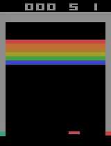

# Breakout 

- Maximize the score in the Atari 2600 game Breakout using Deep Q Networks(DQN). 
- In this environment, the observation is an RGB image of the screen, which is an array of shape (210, 160, 3) 
- Each action is repeatedly performed for a duration of kk frames, where kk is uniformly sampled from {2,3,4}.

