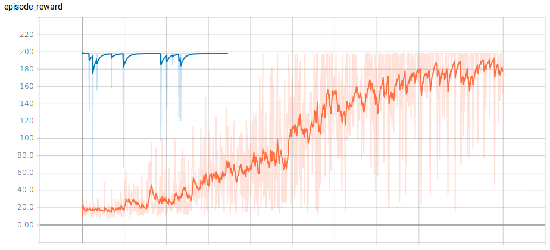
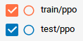

# Proximal Policy Optimization(PPO)  
Implementation of Proximal Policy Optimization(PPO) for classic cartpole environment using tensorflow. 

## Dependencies
- Python: 3.5
- Tensorflow: 1.4 
- Gym: 0.9.3 

## Gym environment

Environment: CartPole-v0
State: Continuous
Action: Discrete

## Implementation:

**Train experts**
 ```
python3 run_ppo.py
```
<p align= "center">
  
</p>

**Test trained policy** 
```
python3 test_policy.py --alg=ppo 
```
|  |  |  
| :---: | :---: |  
| Training and Teasting results for PPO | legend | 
  


